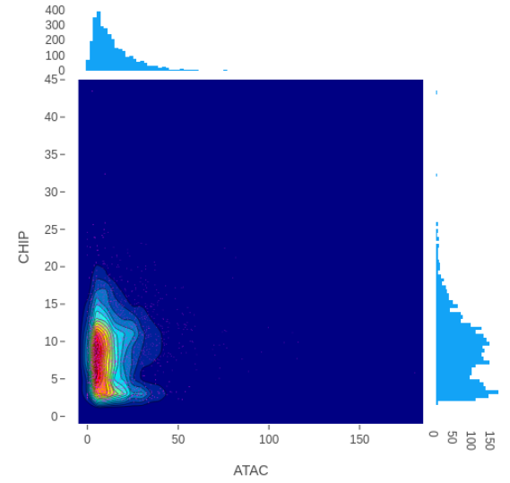
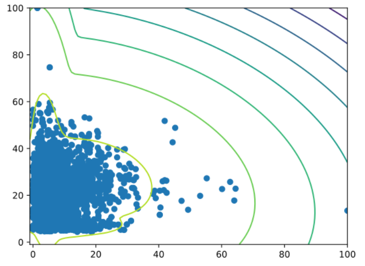
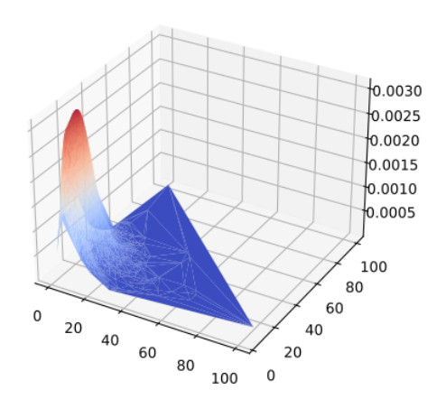

# jlu-bda-2020
This tool allows for the analysis and classification of transcription factors by calculating the relations between TF binding sites and chromatin accessibility, using the [Deepblue Epigenomic Data Server](https://deepblue.mpi-inf.mpg.de/) to link epigenomic ChIP-seq and ATAC/DNAse-seq data by biosource (i.e. cell type).

**Workflow**

 1. Link and download epigenomic data matching user-requested biosources, TFs, genomes and chromosomes
 2. Convert, normalize and sort downloaded data if necessary
 3. Calculate relations between ChIP and ATAC data for each TF and save results as CSV files
 4. Visualize data
 
## Requirements

 - Python 3
 - [Conda](https://docs.conda.io/projects/conda/en/latest/index.html)
 - [npm](https://www.npmjs.com/)
 
## Setup
1. Run `conda env create -f environment.yml` to create a conda environment with the following modules:
```
channels:
- bioconda
- conda-forge
dependencies:
- r-base
- r-data.table
- bioconductor-deepbluer
- ucsc-bedgraphtobigwig
- ucsc-bigwigtobedgraph
- ucsc-bigwigmerge
- pandas
- nodejs
- flask
- flask-restful
- flask-cors
- bash
- pybigwig
```
If the "solving environment" process takes too long, try removing  `bioconductor-deepbluer` from the `environment.yml` and run the command again. Afterwards, run the command `conda install -n wg1 bioconductor-deepbluer` to install the Deepblue package separately.

2. Run `pip install pyBigWig sklearn matplotlib kneed` to install additional required packages (this step will not be required in future versions).
3. Run `conda activate wg1` to activate the environment.

## How to use
The pipeline can be initiated by running `python bin/tf_analyser.py` with these arguments:

`-g, --genome` genome (default: hg19)

`-b, --biosource` list of biosources (default: all)

`-t, --tf` list of transcription factors (default: all)

`-c, --chromosome` list of chromosomes (default: all chromosomes of the selected genome)

`-w, --width` single integer to determine the range of analysis (peak +- w, default: 50)

`-r, --redo_analysis` (optional) existing results will be executed again and overwritten

`-v, --visualize` (optional) skip the downloading + analysis steps, visualize existing results

`-cs, --component_size` (optional) single integer determining the component size for the analysis (will be calculated if not given)

`-o, --output_path` output directory for all data (default: `./`)

"all" refers to all data that is currently available on the Deepblue server.

Use the help argument (`-h` or `--help`) to display a more detailed list of available arguments.

 
## Example case
`python bin/tf_analyser.py -g hg19 -b GM12878 -t RELA -c chr1`

This command will download and analyze all data for transcription factor RELA, sampled from chromosome 1 of the biosource GM12878.

**Results**








## License
(to be added)
